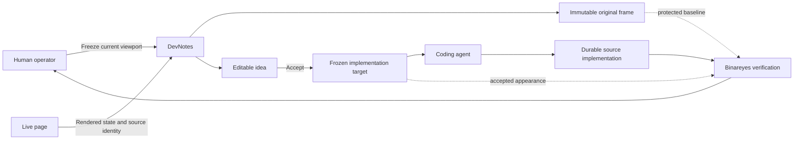
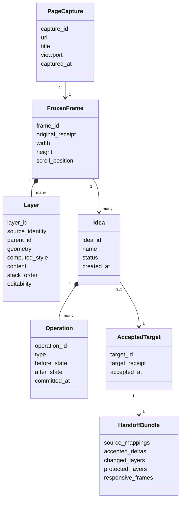
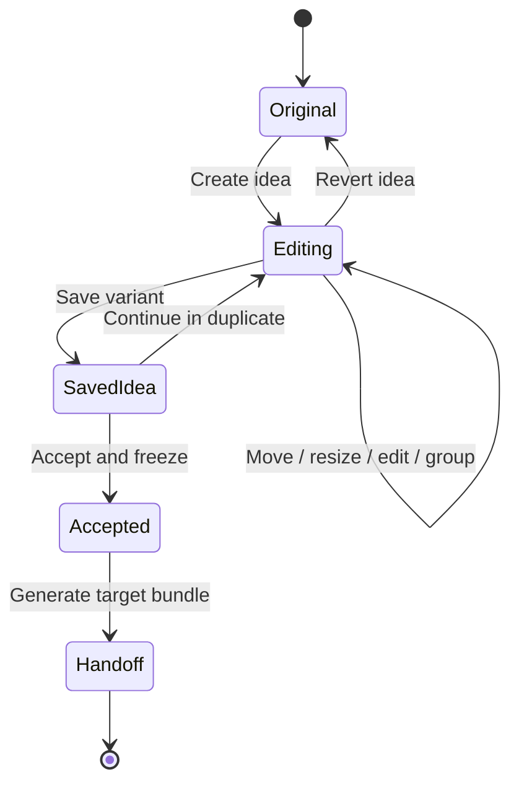
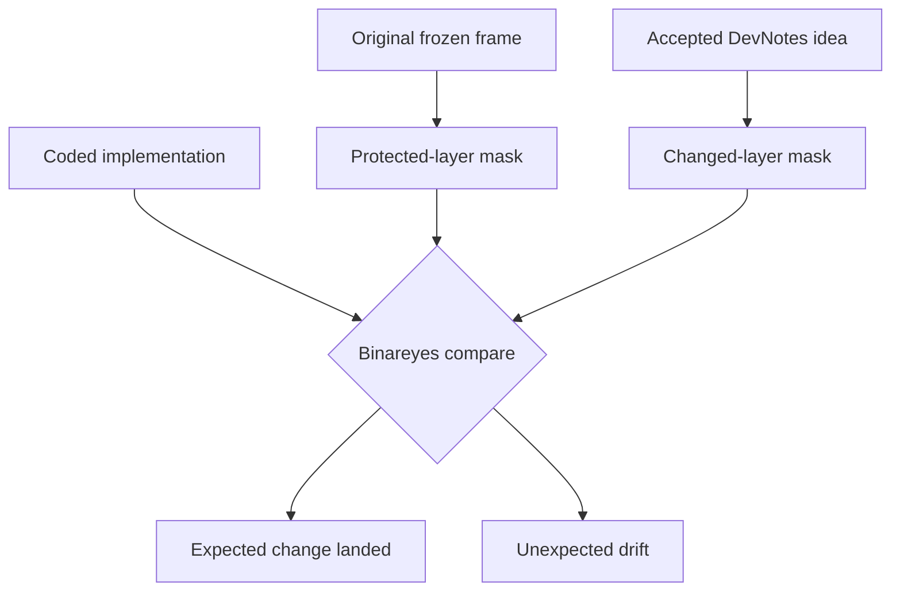

# Frozen layered snapshot

Date: 8 October 2026
Status: accepted concept; proof implemented and extracted to Devsigner

## Product kernel

DevNotes is a live-page overlay that can freeze the rendered page into an
editable, layered snapshot.

The running page remains untouched underneath. The frozen overlay becomes a
direct-manipulation canvas where a person can move, resize, group and edit
captured elements before asking an agent to implement an accepted result in
source code.

This extends DevNotes from annotation and discussion into reversible visual
experimentation. It does not turn DevNotes into a source-code editor or page
builder.

## The need

Small spatial experiments currently require an implementation loop:

1. Describe the desired change to an agent.
2. Wait for a source edit.
3. Inspect the result.
4. Decide that the earlier state was better or try another small variation.
5. Ask the agent to reconstruct or revise it again.

The desired loop is direct:

```text
freeze
select
move / resize / edit
compare
revert or accept
```

The coding agent enters after the person has found and accepted the intended
shape.

## Core invariants

1. **The live page remains unchanged.** Experiments occur in the overlay.
2. **The original frozen frame is immutable.** Revert does not reconstruct it
   from operation history.
3. **Rendered elements remain individually available.** The snapshot is not one
   flattened screenshot.
4. **Source identity remains attached.** Each layer retains a stable mapping to
   the rendered element from which it came.
5. **Direct manipulation is primary.** Coordinates and selectors are supporting
   evidence, not required operator language.
6. **Ideas are reversible variants.** Exploration does not mutate one shared
   state beyond recognition.
7. **Acceptance is explicit.** Only a frozen accepted idea becomes an
   implementation target.
8. **Implementation remains an engineering task.** Temporary placement is not
   presented as durable responsive code.
9. **Verification uses both target and baseline.** Binareyes can identify
   intended change inside selected layers and unintended drift elsewhere.

## System context



## Freeze operation

Freeze captures one rendered page at one explicit viewport.

The capture includes:

- page URL and title;
- viewport width, height, device scale and scroll position;
- a visual receipt of the original frame;
- meaningful rendered elements;
- element geometry and stacking order;
- rendered text and editable copy identity;
- computed typography, colour, borders and backgrounds;
- parent-child relationships;
- a stable source locator such as selector, DOM path and text fingerprint;
- fallbacks for surfaces that cannot become ordinary editable layers.

The page becomes inert underneath the overlay. Scripts and animations do not
continue changing the frozen frame.

## Layer model



## Meaningful layers

"Every element" means that every meaningful rendered thing is available for
selection. It does not require invisible structural wrappers to dominate the
default layer tree.

Default layers may include:

- visible text;
- images;
- SVG graphics;
- controls;
- visible borders and backgrounds;
- layout containers with spatial responsibility;
- groups that preserve visible parent-child relationships.

Structural wrappers may remain discoverable when needed. Canvas, WebGL, video,
cross-origin embeds and other inaccessible surfaces may enter the frame as
rasterized layers. Those layers can still be moved, resized, hidden, duplicated
or compared even when their internal content is not editable.

## Direct manipulation

The primary interaction resembles an object-based visual editor:

```text
click element
    select layer

drag layer
    move layer

drag edge or corner
    resize layer

double-click text
    edit captured copy

shift-click layers
    create temporary group
```

The overlay may expose alignment guides, distances, shared edges, centres and
the original position. An inspector can provide exact values, but ordinary use
should not require selector, CSS or coordinate knowledge.

### Movement

Movement changes the experimental layer position only. It does not mutate the
source element underneath.

### Resizing

Text-box resizing should preserve the captured type treatment and allow text to
reflow. Group resizing needs explicit behaviour, such as proportional scale or
boundary resize with stable children. The first proof does not need to solve
every group-resize mode.

### Copy editing

Captured text can be edited in place. The layer retains both original and
experimental copy. Escape or Revert restores the original text without a page
reload.

### Grouping

Several selected layers can form one temporary experimental group. Grouping in
DevNotes does not imply a permanent wrapper should be introduced in source.

## Ideas and history

An idea is a reversible operation log over the immutable original frame.



Continuous pointer movement should be coalesced into one meaningful operation
when the pointer is released. The system keeps enough working history for Undo
and Redo without presenting every pointer sample as an implementation
instruction.

Example accepted operation:

```json
{
  "type": "resize-layer",
  "layer_id": "layer-home-title",
  "before": { "x": 64, "y": 348, "width": 1024, "height": 168 },
  "after": { "x": 64, "y": 292, "width": 1120, "height": 148 },
  "frame_id": "landing-desktop-1440x900"
}
```

## Viewport boundary

One frozen frame belongs to one viewport. A desktop arrangement does not
automatically claim to be a mobile design.

An accepted idea may eventually contain several reviewed frames:

```text
Idea A
├── desktop · 1440 × 900
├── tablet · 834 × 1112
└── mobile · 390 × 844
```

Each frame is independently frozen and manipulated. Relationships between
frames belong to the implementation handoff; DevNotes should not infer
responsive rules merely from two still arrangements.

## Acceptance and handoff

Accepting an idea creates a read-only target. Continued exploration happens in
a duplicate rather than silently changing the implementation target.

The handoff bundle contains:

- original and accepted visual receipts;
- accepted layer geometry and copy;
- stable source mappings;
- a compact accepted operation log;
- changed layers;
- protected layers expected to remain unchanged;
- viewport review status;
- attached DevNotes discussion where relevant;
- implementation constraints and unresolved questions.

The coding agent uses this bundle as intent evidence. It remains responsible for
clean markup, maintainable styles, fluid behaviour, accessibility and project
conventions.

## Binareyes boundary

Binareyes compares three states:

```text
baseline original
accepted DevNotes target
coded implementation
```

Changed layers are compared with the accepted target. Protected layers are
compared with the original baseline. This separates intended change from
unintended visual drift.



## Product boundary

The frozen layered snapshot is not:

- a lasso-first mapping system;
- a mutation of the live DOM;
- automatic source-code generation;
- a generalized visual website builder;
- a replacement for responsive implementation judgement;
- a replacement for DevNotes annotation and discussion;
- a replacement for Binareyes verification.

Existing DevNotes notes, replies, snapshots and visual receipts remain useful.
They can attach reasoning and discussion to frames, ideas or layers. They are no
longer required to be the primary object of the new editing surface.

## First proof

The first proof is deliberately narrow:

1. Freeze the current portfolio landing at one desktop viewport.
2. Preserve an immutable visual original.
3. Reconstruct meaningful visible elements as selectable overlay layers.
4. Select the headline.
5. Move it.
6. Resize its text box and preserve text reflow.
7. Edit its copy.
8. Toggle between Original and Experiment.
9. Revert the experiment completely.
10. Verify that the live page, runtime state and repository did not change.

Success proves the medium. It does not yet require multi-viewport ideas,
generalized grouping, arbitrary transform controls, source generation or the
full Binareyes handoff.

## Beta 3 proof state

The bounded first proof is implemented as a separate `beta3.js` loader. It
freezes the current viewport into a script-free iframe overlay and indexes
meaningful rendered elements as nested layers. Authored text blocks remain
whole layers even when their markup contains word or phrase spans. The proof
supports selection, Parent traversal, movement, width and height resizing,
whole-block copy editing, common text formatting, Undo, Redo, per-layer revert,
Original/Experiment comparison, Reset and Exit.

Movement includes magenta alignment guides and snapping for the selected
layer's edges and centres against nearby frozen layers, viewport edges and the
viewport centre. Ancestors and descendants are excluded from one another's snap
candidates to avoid nested-layout guide noise.

The live portfolio proof captured 15 meaningful layers and verified five
semantic operation types: `move-layer`, `resize-layer`, `format-text`,
`format-inline-text` and `edit-copy`. Text formatting currently covers size,
line height, letter spacing, alignment, case transform, weight, italic,
underline and strike-through. The text block remains one canvas layer while a
native range inside it can receive Bold, Italic, Underline or Strike without
promoting each word to a layer. Original restored the starting markup,
formatting and geometry. Reset cleared the experiment, Exit removed the overlay,
and the underlying live `<main>` remained byte-identical.

This proof does not implement saved ideas, accepted-target persistence,
multi-viewport frames, implementation handoff or Binareyes verification. The
current runtime boundary is documented in [`../BETA-3.md`](../BETA-3.md).

The proof subsequently established a separate product boundary. Standalone
development continues as **Devsigner** in
[`tryskian/devsigner`](https://github.com/tryskian/devsigner). This document
remains the accepted architecture and incubation record inside DevNotes.

## Open questions

- Which rendered elements become default layers, and which remain nested until
  explicitly selected?
- How are pseudo-elements represented?
- How should fixed and sticky elements behave inside a frozen frame?
- Which fonts and generated effects can be reproduced faithfully in the
  overlay without flattening?
- What is the minimum stable source identity required across reloads?
- How should layer grouping preserve original parent-child relationships?
- When does resizing mean text-box reflow versus proportional visual scale?
- How are several viewport frames associated with one idea without implying an
  invented responsive rule?
- What exact artifact should Binareyes consume first: masks, receipts,
  operations, or a combined bundle?

## Provenance

The accepted concept emerged through direct conversation on 8 October 2026.
The primary-source transcript, correction sequence and structured
interpretation are retained in Polinko's private transcript archive under the
record `devnotes_frozen_layered_snapshot_direct_manipulation_2026-10-08`.
